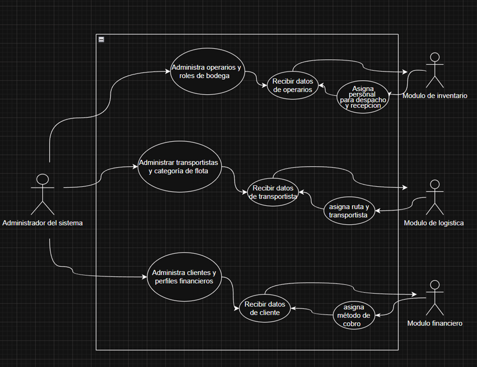

Modulo Personas
Actúa como el proveedor central de actores o identidades para el resto del sistema, Este módulo interactúa directamente con los tres bloques principales enviando o recibiendo información de los diferentes roles: Operarios, Clientes y Transportistas.

Diagrama de casos de uso

Especificaciones

Gestión de Operarios
Funcionalidad: Permitir el registro, actualización, inactivación y consulta de los operarios de la empresa.
Datos clave: ID, Nombre completo, Área de trabajo (Bodega/Logística), Estado (Activo/Inactivo).
Integración con M1: Debe proveer un endpoint (API) o servicio para que M1 valide qué operario está procesando un pedido.

Gestión de Transportistas

Funcionalidad: Controlar el personal encargado de la distribución física.
Datos clave: ID Transportista, Nombre, Teléfono, capacidad.
Integración con M2: Cuando M2 ("Distribución") calcula y asigna la ruta, requiere consultar este componente para vincular al transportista disponible.

Gestión de Clientes

Funcionalidad: Administrar la base de datos de los clientes que realizan pedidos.
Datos clave: Cédula/NIT, Nombre, Dirección de entrega, Teléfono, Ciudad/Región.
Integración M3: Consume este módulo para generar la factura con los datos del cliente.

Casos de uso

C.U #1: Administrar Operarios y Roles de Bodega
Actor Principal: Administrador del sistema.
Actores Secundarios: Módulo de Inventario (M1).
Flujo Principal:
1.	El Administrador ingresa al submódulo de gestión de operarios.
2.	El sistema consulta la base de datos y despliega la lista de todo el personal registrado.
3.	El Administrador selecciona una acción: Registrar un nuevo operario o actualizar datos de un operario existente.
4.	Al procesar el registro o actualización, el Administrador diligencia obligatoriamente los campos clave: ID, Nombre completo, Área de trabajo (Bodega o Logística) y asigna su Estado (Activo/Inactivo).
5.	El Administrador guarda los cambios; el sistema valida que no existan campos vacíos ni datos duplicados y confirma el éxito de la acción.

C.U #2: Administrar Transportistas y Categoría de Flota
Actor Principal: Administrador del sistema.
Actores Secundarios: Módulo de Logística (M2).
Flujo Principal:
1.	El Administrador abre el panel de gestión de Transportistas.
2.	El sistema visualiza sus datos actuales: ID Transportista, Nombre, Teléfono y Capacidad.
3.	El Administrador registra una nueva hoja de vida o edita la existente.
4.	El sistema procesa los datos registrados o actualizados y hace validación y actualización.

C.U #3: Administrar Clientes y Perfiles Financieros
Actor Principal: Administrador del sistema.
Actores Secundarios: Módulo Financiero (M3).
Flujo Principal:
1.	El Administrador selecciona la interfaz de gestión de clientes.
2.	El sistema presenta el buscador general por ID.
3.	El Administrador ingresa o modifica el perfil técnico del cliente: Cédula, NIT, Dirección de entrega, Teléfono y Ciudad/Región.
4.	El sistema procesa los datos registrados o actualizados y hace validación y actualización.
